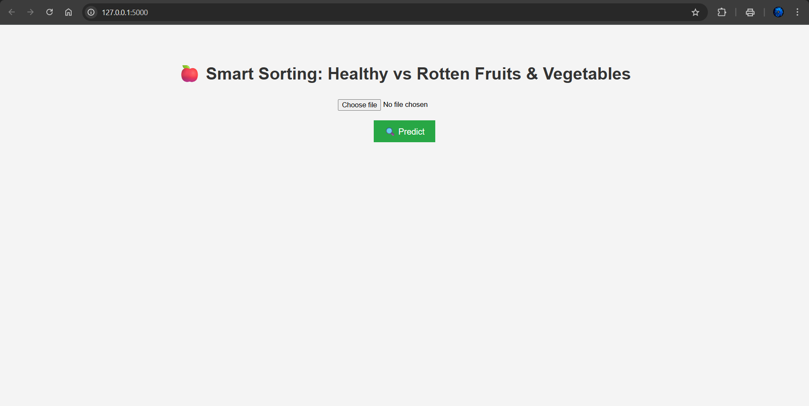

# 🍎 Smart Sorting: Transfer Learning for Identifying Rotten Fruits and Vegetables

A deep learning-based system for classifying fruits and vegetables as **healthy** or **rotten** using **Transfer Learning** and a simple **Flask web interface**.

---

## 🔍 Project Overview

This project aims to assist vendors, farmers, and warehouses in detecting spoiled produce using image classification. We utilize pre-trained models through Transfer Learning to achieve high accuracy, even with a limited dataset.

---

## 📁 Folder Structure

```
Smart Sorting/
├── templates/              # HTML files for Flask frontend
│   └── index.html
├── static/                 # Uploaded images and other assets
│   └── uploads/
├── app.py                  # Main Flask application
├── healthy_vs_rotten.h5    # Pre-trained model
└── README.md
```

---


---

## ⚙️ Technologies Used

- **Python**
- **TensorFlow / Keras**
- **Transfer Learning (MobileNetV2 or similar)**
- **Flask**
- **HTML/CSS (for basic frontend)**
- **Git & GitHub**

---

## 🧠 Model Details

The `.h5` file contains a pre-trained model using **Transfer Learning** techniques (like MobileNetV2). It classifies images into two categories:

- ✅ Healthy  
- ❌ Rotten  

---

## 📷 Sample Result



---

## 📚 Future Improvements

- Add support for more fruit/vegetable categories.
- Improve frontend with drag-and-drop uploads.
- Integrate with a real-time camera feed or IoT system.
- Build a mobile app version.

---

## 🤝 Contributing

Feel free to fork this repository and submit a pull request with improvements!

---

## 📄 License

This project is open-source under the [MIT License](LICENSE).

---


## 🙋‍♂️ Author

**Kumar Saurav**  

🔗 **GitHub:** https://github.com/KumarSaurav-29  
🔗 **LinkedIn:** https://www.linkedin.com/in/kumar-saurav29

---

